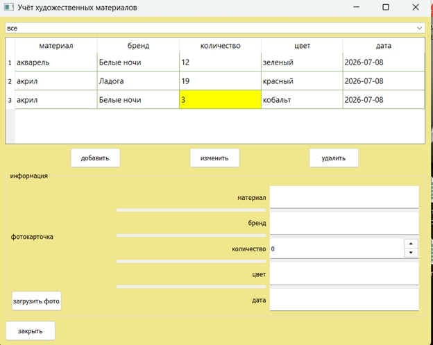
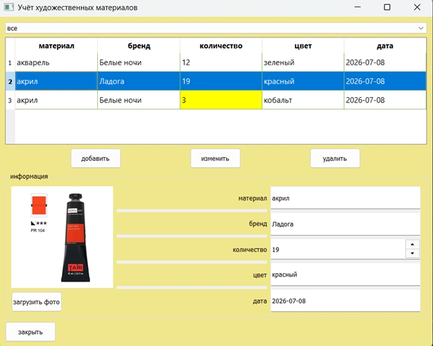

# Учёт художественных материалов
Приложение для введения учёта художественных материалов с возможностью отслеживания количества материала
## Запуск проекта
1 Создайте виртуальное окружение: `python -m venv venv`

2 Активируйте:
- Windows: `venv\Scripts\activate`
- macOS/Linux: `source venv/bin/activate`
  
3 Установите зависимости: `pip install -r requirements.txt`
  
4 Запустите: `python main.py`
## Структура проекта
- `main.py` → Точка входа, настройка `QApplication`, сигналы, обработка событий
- `ui_main.py` → Интерфейс
- `database.py` → Работа с SQLite (CRUD)
- `images/` → Ресурсы (изображения, иконки)
- `.gitignore` → Исключения для Git
- `README.md` → Описание
- `requirements.txt` → Зависимость
## Скриншоты приложения

*Главное окно*

*Выбор записи*

*Сортировка (от А до Я)*
## Примечания
1) чтобы загрузить изображения сначало добавить их в images/
2) желтый цвет в таблице означает, что количества материала мало
## Горячие клавиши
- `Ctrl+K` → Добавление записи
- `Del` → Удаление записи
- `Ctrl+C` → Закрытие приложения
- `Ctrl+L` → Загрузка изображения
- `Ctrl+E` → Изменение записи
## Возможности
- Добавление материала с заполнением всех полей
- Редактирование выбранной записи
- Удаление записи с подтверждением
- Загрузка фото через диалог выбора файла
- Автоматическое масштабирование фото до 200×200
- Сортировка по цвету (А-Я / Я-А) и по названию
- Подсветка строк с остатком < 5 (жёлтым)
- Все данные сохраняются в SQLite (`accounting.db`)
## Автор
Иванова Виктория Валерьевна
ФМ-14-25
##
2026 - Учебная (вычислительная) практика
